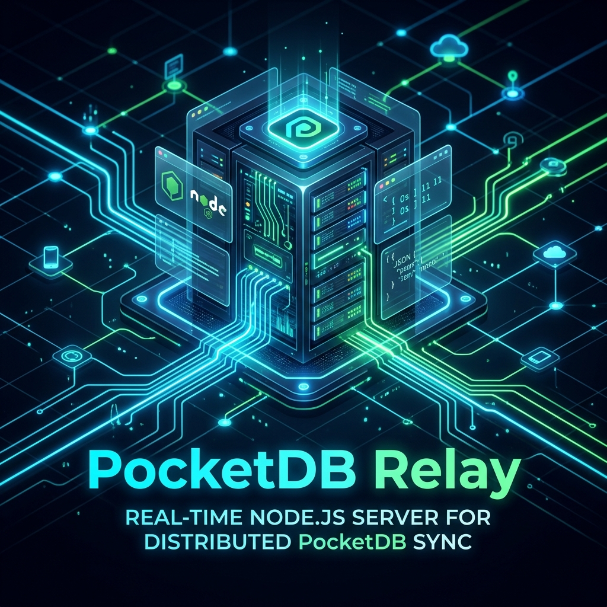

<div align="center">
  
  <br /><br />
  
  <h1>☁️ PocketDB Relay Server</h1>
  <p><strong>El puente inteligente entre tus aplicaciones y tus bases de datos móviles.</strong></p>
  
  <p>
    
    
    
  </p>
</div>

<br />

## 🌐 Arquitectura del Ecosistema

PocketDB Relay Server es la pieza central que hace posible la magia. Dado que los teléfonos móviles no pueden exponer puertos estáticos a internet debido a las reglas de los proveedores de red (NAT), este servidor actúa como un **Túnel Inverso (Reverse Proxy)**.

1. Tu [Aplicación Móvil](https://github.com/NekoCoder-en/PocketDB) abre una conexión persistente (WebSocket) hacia este servidor.
2. Este servidor expone una API REST moderna (`/api/query`) y un CLI Interactivo.
3. Cuando envías una consulta SQL al servidor, este la enruta instantáneamente a través del socket hacia el teléfono, espera que SQLite la procese, y te devuelve los resultados en formato JSON.

## 🚀 Despliegue en Producción (Cloud)

Este servidor mantiene conexiones persistentes en memoria (WebSockets). Por lo tanto, **NO** es compatible con plataformas Serverless (como Vercel o AWS Lambda). 
Debe ser alojado en entornos que soporten procesos Node.js continuos. Recomendamos **Render.com**, **Railway** o **Fly.io**.

**Para desplegar en Render:**
Simplemente vincula tu repositorio de GitHub a un "Web Service" en Render. El `package.json` ya está configurado con los scripts `"start"` y `"dev"` requeridos por Render para iniciar automáticamente usando `node index.js`.

---

## 💻 PocketDB CLI (Consola Interactiva)

Hemos incluido una herramienta de línea de comandos (CLI) que simula la experiencia de estar conectado a un servidor MariaDB o MySQL tradicional. Traduce inteligentemente comandos comunes hacia SQLite y te permite administrar tus bases de datos desde tu PC.

**Uso:**
Abre tu terminal y ejecuta el script pasando el ID que aparece en la pantalla de tu app móvil, junto con la URL de tu Relay Server:

```bash
# Ejemplo:
node cli.js 3C9DT6 https://pocketdb-relay.onrender.com
```

**Comandos soportados en la Consola:**
```sql
pocketdb> SHOW DATABASES;                    -- Lista los archivos .db en tu teléfono
pocketdb> CREATE DATABASE ecommerce;         -- Crea una nueva base de datos aislada
pocketdb> USE ecommerce;                     -- Cambia el contexto a la nueva BD
pocketdb> CREATE TABLE usuarios (id INT);    -- Crea tablas en la BD activa
pocketdb> SHOW TABLES;                       -- Lista las tablas
pocketdb> DESCRIBE usuarios;                 -- Muestra la estructura de la tabla
pocketdb> SELECT * FROM usuarios;            -- Consultas normales
```

---

## 🔌 API REST (Integración con tu Backend/Frontend)

Si estás construyendo una aplicación real (ej. un backend en NestJS o un frontend en React) y quieres guardar los datos en tu celular, usa nuestra API HTTP.

**Endpoint:** `POST /api/query/:deviceId`

### Ejemplo usando `fetch` (JavaScript / TypeScript)

```javascript
async function guardarUsuario() {
  const DEVICE_ID = '3C9DT6';
  const RELAY_URL = 'https://pocketdb-relay.onrender.com';

  // 1. Primero seleccionamos la base de datos que queremos usar
  await fetch(`${RELAY_URL}/api/query/${DEVICE_ID}`, {
    method: 'POST',
    headers: { 'Content-Type': 'application/json' },
    body: JSON.stringify({ sql: 'USE ecommerce;' })
  });

  // 2. Ejecutamos nuestra consulta real
  const response = await fetch(`${RELAY_URL}/api/query/${DEVICE_ID}`, {
    method: 'POST',
    headers: { 'Content-Type': 'application/json' },
    body: JSON.stringify({ 
      sql: "INSERT INTO usuarios (nombre, edad) VALUES ('Ana', 28);" 
    })
  });

  const json = await response.json();
  if (json.success) {
    console.log('Fila insertada. ID generado:', json.data.lastInsertRowId);
  }
}
```

### Respuesta de Éxito (`SELECT`)
```json
{
  "success": true,
  "data": [
    { "id": 1, "nombre": "Ana", "edad": 28 }
  ]
}
```

### Respuesta de Éxito (`INSERT` / `UPDATE`)
```json
{
  "success": true,
  "data": {
    "lastInsertRowId": 1,
    "changes": 1
  }
}
```

<div align="center">
  <p><i>Desarrollado para la próxima generación de arquitecturas distribuidas.</i></p>
</div>
